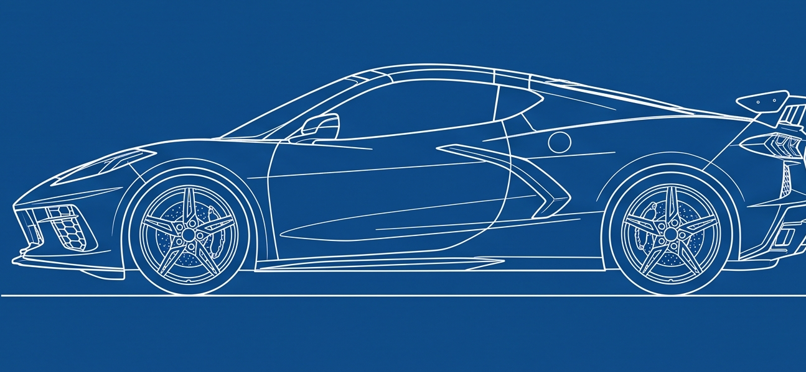

# Post-mortem: Gerador Procedural de Veículos

> Data do encerramento: 2026-06-30.
> Branch onde viveu: `versao-brasileira-herbert-richers`.
> Status: **encerrado e removido do código.** Tudo que existia está documentado
> aqui. O código em si era rastreado pelo git, então continua recuperável pelo
> histórico (`git log`, `git checkout`) mesmo depois de apagado do disco.

Este documento registra o que foi construído, como funcionava, o resultado real,
por que o caminho foi abandonado, e qual a recomendação para uma próxima tentativa.
É o arquivo-túmulo do projeto: leia antes de tentar de novo.

---

## 1. O que o projeto queria ser

Um gerador procedural de carroceria de carros dentro do Blender (headless,
Python/bmesh), controlado por ferramentas MCP. A ideia: a IA descreve um carro por
parâmetros (ou por um blueprint), e o sistema gera a malha 3D, renderiza, mede,
compara com a referência e corrige sozinho, gastando poucos tokens do host.

O alvo de qualidade era um supercarro estilo Corvette C8 / Lamborghini Huracán:
baixo, em cunha, cabine recuada, rodas grandes, linhas duras.

A tese original (do plano) era um fluxo híbrido: blueprint vira `VehicleSpec`
verificável, um rig dimensional vira fonte de verdade, a carroceria nasce de curvas
e seções por loft, os detalhes são features ancoradas, e um loop
gerar→renderizar→medir→comparar→corrigir fecha a fidelidade.

---

## 2. Como o motor funcionava (arquitetura real)

O coração era um **motor de volume único e reutilizável** (`generators/volume.py`),
e a carroceria (`generators/body_loft.py`) era construída em cima dele.

O mecanismo, em uma frase: **uma seção transversal paramétrica fechada (uma
superelipse) era varrida ao longo do eixo X, interpolando poucas seções-chave, e os
anéis resultantes eram ligados por faces quad formando um tubo tampado nas pontas.**

Em detalhe:

1. A seção transversal era uma superelipse fechada de K vértices, descrita por
   meia-largura, topo, base, expoentes de arredondamento (`ny`/`nu`/`nl`),
   tumblehome e deslocamento de centro.
2. Definiam-se seções-chave em posições `t` de 0 a 1 ao longo do comprimento.
3. O motor varria a seção ao longo do eixo, interpolando campo a campo entre as
   seções-chave com `smoothstep`, gerando N anéis.
4. Anéis vizinhos eram ligados por quads (loft); as pontas eram tampadas por um
   leque de triângulos a partir de um vértice central.
5. Aplicavam-se modificadores: Subdivision Surface (suavização), Weighted Normals,
   Mirror em Y, e vincos (crease) em colunas escolhidas.
6. A carroceria baixa e a cabine (greenhouse) eram volumes separados; as caixas de
   roda saíam por boolean.

Coordenadas: X = comprimento (frente +X), Y = largura, Z = altura, origem no centro
do entre-eixos no chão.

---

## 3. O que chegou a ser construído

O MVP fechou as Fases 0 a 6 do plano (faltou só a Fase 7, qualidade/generalização).

**Estrutura do workspace** (`vehicle_workspace/`):

- `vehicle/` — schema do `VehicleSpec`, unidades (mm↔m), sistema de coordenadas.
- `archetypes/` — presets por tipo (supercar, sedan, suv, pickup...).
- `generators/` — `rig.py`, `blockout.py`, `volume.py` (o motor), `body_loft.py`
  (a carroceria), `wheels.py` (roda com pneu+aro+disco+pinça+5 raios),
  `lights.py`, `aero.py`, `intakes.py`, `mirrors.py`, `blender_utils.py`.
- `vision/` — `silhouette.py`, `compare.py`, `overlay.py` (calibração de blueprint
  e comparação de silhueta por IoU de forma).
- `validation/` — `dimensions.py`, `symmetry.py`, `wheel_fitment.py`,
  `feature_presence.py`.
- `orchestration/` — `pipeline.py`, `iteration.py`, `budgets.py` (o loop
  automático gera→compara→ajusta `spec["tuning"]`→repete).
- `sculptor/` — `contour.py`, `compare.py`, `render_snapshot.py` (ferramentas de
  modelagem/edição iterativa adicionadas no fim).

**Ferramentas MCP expostas** (no `geracao_3d_mcp.py`, removidas no encerramento):

- `vehicle_listar_arquetipos`, `vehicle_criar_spec`, `vehicle_gerar_rig`,
  `vehicle_gerar_blockout`, `vehicle_gerar_modelo`, `vehicle_renderizar_vistas`,
  `vehicle_auditar`, `vehicle_calibrar_blueprint`, `vehicle_comparar_blueprint`,
  `vehicle_iterar`, `vehicle_pipeline`.
- Bloco sculptor: `sculptor_exec`, `sculptor_render`, `sculptor_compare`,
  `sculptor_extract_contour`, `sculptor_mesh_info`, `sculptor_list_objects`,
  `sculptor_get_vertices`, `sculptor_move_vertices`, `sculptor_save_checkpoint`,
  `sculptor_restore_checkpoint`, `sculptor_set_workspace`.

**Modo de trabalho que funcionou** (o loop rápido): editar gerador → rodar Blender
5.1.2 headless direto pelo terminal (`blender.exe --background --python script.py`,
traz numpy) → ler os PNGs renderizados → julgar visualmente → ajustar. A comparação
de silhueta rodava no `.venv` (numpy + Pillow).

---

## 4. O resultado real

A meta era o supercarro abaixo. O resultado foi um borrão alongado, apelidado de
"tubo de pasta de dente". As imagens estão na pasta `imagens/` ao lado deste arquivo.

**Resultado gerado (vista lateral):**

**Alvo, Corvette (blueprint gerado pelo Gemini):**

**Alvo, 4 vistas geradas pelo Gemini:**

**Alvo, Huracán (referência que estava cortada/baixa resolução):**

A distância entre o resultado e o alvo não era de ajuste fino. Era estrutural.

---

## 5. Por que falhou: o teto real (análise honesta)

Uma análise técnica independente do motor (lendo o código e as imagens) concluiu
que o problema tem duas camadas, e a de baixo é uma parede de concreto.

### Camada de cima: bugs e tuning (consertável)

O render final estava até **pior** do que o próprio código deveria produzir. Os
vincos sumiam (Subdivision Surface comendo o crease), o boolean da caixa de roda
provavelmente falhava em silêncio dentro de um `try/except`, e a cabine não
aparecia encaixada. Isso era conserto de oficina, não troca de motor. Mas consertar
isso só revelaria o teto real, não o superaria.

### Camada de baixo: a arquitetura (o teto de verdade)

Uma superelipse **fechada e convexa**, varrida e suavizada ao longo de um eixo,
produz por construção uma cápsula lisa, um charuto que afunila nas pontas. Essa é
exatamente a família de formas do tubo de pasta de dente. Tudo que faz um carro
deixar de ser cápsula (concavidade, aresta diagonal, painel separado, undercut) tem
que ser forçado *contra* a tendência natural da abordagem, não construído a favor.

**As LEIs (limites reais, não falta de esforço):**

1. Uma seção fechada estrela-convexa não representa concavidade dentro do próprio
   anel. Cada raio a partir do centro cruza a superfície uma única vez. Logo nenhuma
   reentrância ou dobra-pra-dentro existe dentro de um anel.
2. A topologia é um grid fixo (K colunas × N anéis). As arestas só correm em duas
   direções (ao longo do eixo e ao redor do anel). Uma linha de caráter diagonal,
   marca registrada de Lambo/Corvette, não tem aresta onde morar e some sob subdiv.
3. A densidade de malha é constante ao longo do comprimento. Onde o carro precisa de
   muito detalhe (frente, faróis) e onde precisa de pouco (lateral) têm a mesma
   resolução.
4. Um volume único é topologicamente uma esfera. Não cabe buraco que atravessa,
   ramificação, nem overhang que dobra por trás de si mesmo.

**A saída para essas leis era "peças separadas costuradas"** (a intuição certa que
chegou a ser tentada com corpo + cabine). Mas o custo migra da geração da forma para
a manutenção das junções, e esse custo cresce mais rápido que a fidelidade ganha.
Com 2 peças já era frágil; com 8 a 10 peças (capô, para-lamas, portas, difusor,
splitter, teto, colunas) a costura procedural viraria o trabalho dominante e abriria
buracos a cada mudança de parâmetro.

**Veredito:** a varredura de seção chega num carro reconhecível e estilizado, tipo
concept mole de jogo antigo. Não chega num supercarro de alta fidelidade com linhas
de caráter, painéis e undercuts. O teto não é "feio", é "genérico e mole", e é LEI,
não suposição.

---

## 6. Recomendação para a próxima tentativa

O erro de raiz foi tratar **"100% procedural"** como exigência. Isso era um teto
auto-imposto, não uma lei da natureza. O que faz um supercarro parecer um supercarro
é a **topologia**: onde estão os loops de aresta, as linhas de caráter, as
separações de painel, os undercuts. A topologia certa de um carro é uma decisão de
design, não é derivável de uma fórmula simples. Por isso nenhuma abordagem que
*gera* a topologia a partir de poucos parâmetros (varredura, metaball, SDF puro)
entrega isso com controle.

Caminho recomendado, em ordem:

1. **Base-mesh topologicamente correta, deformada por parâmetro** (recomendado).
   Modela-se à mão, uma vez, uma malha-base de carro com os loops nos lugares certos
   (contornando caixa de roda, acompanhando as linhas, separando cabine). O
   procedural só *deforma* essa base para bater no blueprint. É como os pipelines
   reais de carro paramétrico funcionam. Não é 100% procedural, e tudo bem.
2. **SDF + marching cubes + retopo** (se quiser manter o espírito procedural a
   ferro). Concavidade, undercut e buraco saem de graça do campo escalar. Custo:
   malha vira sopa de triângulos (precisa retopo) e aresta viva exige truque. Fica
   mais orgânico que anguloso, então é pior justamente para C8/Huracán.
3. Surfacing por curvas em múltiplas vistas (tipo CAD/NURBS): teto teórico mais
   alto, custo de engenharia também o mais alto.
4. Box-modeling procedural (extrusão + loop cut programáticos): topologia limpa, mas
   frágil ("qual aresta selecionar" quebra a cada mudança).
5. Geometry Nodes como infraestrutura para qualquer uma das de cima.
6. Metaballs: pior de todas para forma angulosa. É literalmente uma máquina de fazer
   tubo de pasta de dente mais sofisticado.

O que dá para **reaproveitar** numa próxima tentativa: a ideia do `VehicleSpec`
verificável, o rig dimensional como fonte de verdade, e principalmente o módulo de
**comparação de silhueta / calibração de blueprint** (`vision/`), que é agnóstico ao
motor de geometria e serviria a qualquer abordagem.

---

## 7. O que foi apagado e o que sobrou

**Apagado do disco no encerramento:**

- `vehicle_workspace/` inteiro (rastreado pelo git, recuperável pelo histórico).
- `references/supercar/`, `references/blueprints/`, `references/imagens/` (blueprints
  do veículo; cópias do essencial estão em `imagens/` aqui).
- `.agents/` (scaffolding não-rastreado).
- `docs/plano_gerador_veiculos.md` (plano original; seu conteúdo essencial está
  resumido neste post-mortem).
- O bloco de ferramentas MCP `vehicle_*` e `sculptor_*` do `geracao_3d_mcp.py`.

**Mantido:**

- O MCP geral de geração de peças mecânicas e suas referências
  (`references/bearing/`, `references/brake_disc/`, `references/caliper/`).
- Este post-mortem e as imagens em `imagens/`.

Para ressuscitar o código antigo, se algum dia for útil olhar:
`git log --all -- vehicle_workspace` e `git checkout <commit> -- vehicle_workspace`.
